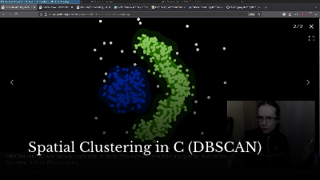

# DBSCAN

Notes from [DBSCAN](https://en.wikipedia.org/wiki/DBSCAN) exploration session:

[](https://www.youtube.com/watch?v=VMatzTGT8NI)

## Quick Start

```console
$ cc -o nob nob.c
$ ./nob
$ ./build/dbscan
$ ./build/image_segs
```
